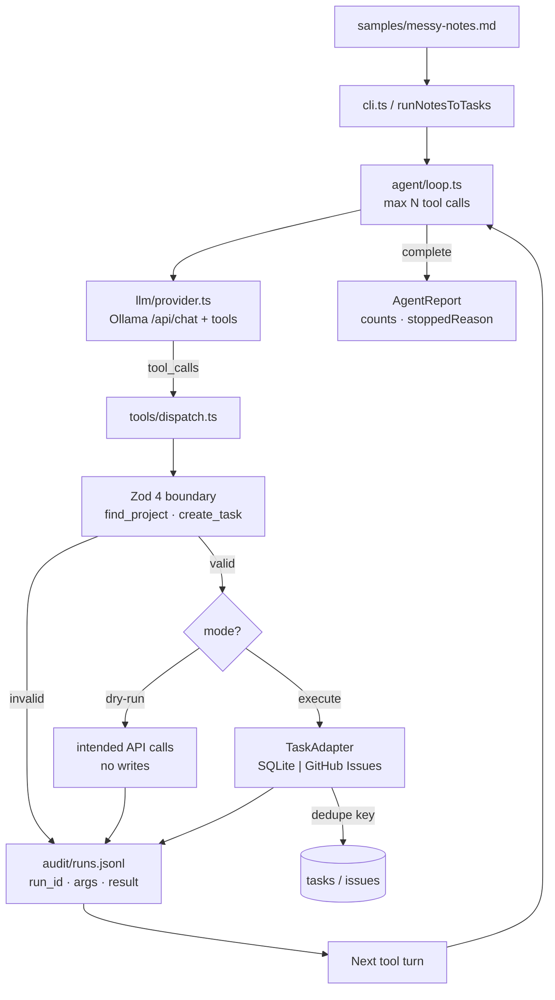
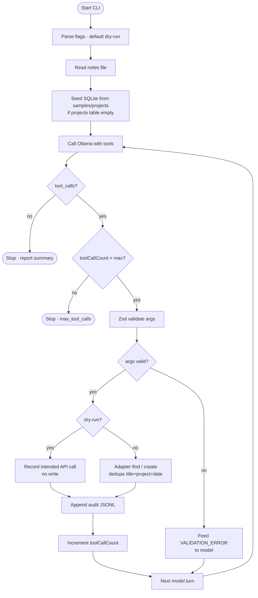

# ai-notes-to-tasks-agent

[](https://github.com/he-is-talha)

Turns messy standup/meeting notes into real tasks through exactly two Zod-validated tools — with dry-run by default, a bounded agent loop, and an append-only audit log.


> Demo: `docs/demo.gif` / `docs/demo.mp4` — hook → notes → projects → execute (12 tasks) → SQLite dump → audit.

## What it does

- Exactly two tools: `find_project(query)` and `create_task(title, assignee, due_date, project)`
- Zod 4 validates args at the tool boundary and returns structured errors (never throws into the agent loop)
- Bounded agent loop (`MAX_TOOL_CALLS`; demo `.env` uses `40` for long notes)
- `--dry-run` default (prints intended API calls, writes **zero** tasks); `--execute` for side effects
- SQLite offline demo; projects seeded from `samples/projects` (edit to use your own); optional GitHub Issues adapter (`ADAPTER=github`)
- Append-only `audit/runs.jsonl` correlated by `run_id`
- Idempotent creates via dedupe key `title + project + due_date`

**Model:** Ollama `qwen3.5:4b`. **Notes:** `samples/messy-notes.md`.

## Architecture



## Code flow — sequence diagram

Cross-file path for `npm run demo:execute` (same loop as dry-run; mode selects writes):

```mermaid
sequenceDiagram
  participant User
  participant CLI as cli.ts
  participant Run as cli/run.ts
  participant Loop as agent/loop.ts
  participant Prompt as agent/prompt.ts
  participant LLM as llm/provider.ts
  participant Ollama as Ollama qwen3.5:4b
  participant Disp as tools/dispatch.ts
  participant Zod as tools/* + schema/*
  participant Adapt as adapters/sqlite.ts
  participant Audit as audit/writer.ts
  participant DB as data/tasks.db

  User->>CLI: notes-to-tasks --execute --notes messy-notes.md
  CLI->>Run: runNotesToTasks(mode=execute)
  Run->>Adapt: seedIfEmpty()
  Run->>Loop: runAgent(notes, ctx, llm, maxToolCalls)
  Loop->>Prompt: system + prepareNotesForModel(notes)
  loop until no tool_calls or budget
    Loop->>LLM: chat(messages, ollamaTools())
    LLM->>Ollama: POST /api/chat tools=[find_project, create_task]
    Ollama-->>LLM: message + tool_calls
    LLM-->>Loop: ChatResponse
    alt tool_calls present
      Loop->>Disp: dispatchTool(name, args)
      Disp->>Zod: safeParse args
      alt invalid
        Zod-->>Disp: VALIDATION_ERROR
        Disp->>Audit: appendAudit
        Disp-->>Loop: ToolResult error
      else valid
        Disp->>Adapt: findProject / createTask
        Adapt->>DB: read / insert-or-dedupe
        Adapt-->>Disp: ok data
        Disp->>Audit: appendAudit
        Disp-->>Loop: ToolResult ok
      end
      Loop->>Loop: append role=tool message
    else done
      Loop-->>Run: AgentReport
    end
  end
  Run-->>CLI: print intended calls + counts
  CLI-->>User: tasks_after / audit path
```

## Logical flow — activity diagram



## Quickstart

```bash
cp .env.example .env   # set OLLAMA_HOST; MAX_TOOL_CALLS=40 for messy-notes
# Optional: edit samples/projects (one name per line), then use a fresh SQLITE_PATH
ollama pull qwen3.5:4b
npm i
npm test
npm run demo:dry-run    # samples/messy-notes.md
npm run demo:execute    # writes data/tasks.db
```

```bash
# Docker (no cloud API key)
docker compose up -d ollama
docker compose exec ollama ollama pull qwen3.5:4b
docker compose run --rm app npm run demo:dry-run
```

## Published numbers

### Unit / e2e (`npm test`)

| Metric | Value |
|--------|-------|
| Tests | `64` passed |
| Validation refusal fixtures | `6` (100% refused) |
| Recovery | `1` refusal → success in `2` calls |
| Idempotent re-run (scripted) | `duplicateSkips = 2`, tasks delta `0` |
| Dry-run ↔ execute intended-call parity | pass |
| Tools | exactly `2` |

### Live against `samples/messy-notes.md` (`qwen3.5:4b`, `MAX_TOOL_CALLS=40`)

| Metric | Value |
|--------|-------|
| First `--execute` | `tool_calls=15`, **`tasks_after=12`**, `stopped=completed` |
| Second `--execute` | `duplicate_skips=7` (identical title+project+due_date); extra rows only if the model picks a different project name |
| First-run projects | Payments, Authentication, Infrastructure |
